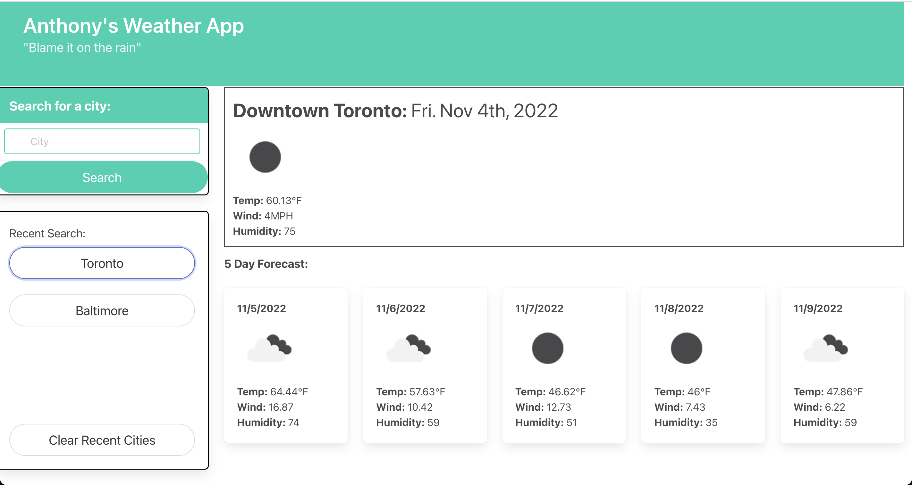

# Weather Forecasting App

## Description

This project helped me improve my skills in connecting to APIs to pull data and images and display them on a page. As a result, I learned how to ingest a user's city, convert to a latitude and longitude, then return current weather and a 5-day forecast. The most recent search is saved below for quick access when returning to the site.

[Link To Page](https://asreedy82.github.io/weather-dashboard-challenge/)

## Installation

N/A

## Usage

The webpage is intended to give a user current weather and a 5-day forecast of the weather in a city that they enter as a search. They can also see their recent search and click on that button to view recent weather.

## Credits

N/A

## License

N/A

### Author: Anthony Reedy